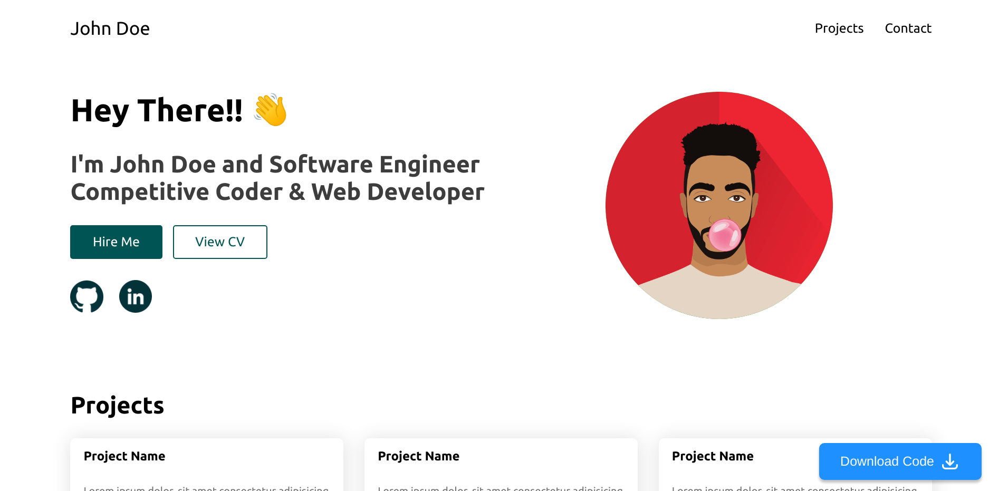

<!-- PROJECT LOGO -->
<br />
<p align="center">
  <a href="https://github.com/Maryam4321/Portfoliomatic">
    
  </a>

  <h3 align="center">Portfoliomatic</h3>

  <p align="center">
     Welcome to the Portfolio Generator project! This platform is crafted using NextJS to help professionals create and deploy their personal portfolio sites effortlessly. Dive into our documentation, view the demo, or contribute to this open-source initiative.
    <br />
    <a href="https://github.com/Maryam4321/Portfoliomatic "><strong>Explore the docs »</strong></a>
    <br />
    <br />
  </p>
</p>

<!-- TABLE OF CONTENTS -->
<details open="open">
  <summary><h2 style="display: inline-block">Table of Contents</h2></summary>
  <ol>
    <li>
      <a href="#about-the-project">About The Project</a>
      <ul>
        <li><a href="#built-with">Built With</a></li>
      </ul>
    </li>
    <li>
      <a href="#getting-started">Getting Started</a>
      <ul>
        <li><a href="#prerequisites">Prerequisites</a></li>
        <li><a href="#installation">Installation</a></li>
      </ul>
    </li>
    <li><a href="#contributing">Contributing</a></li>
    <li><a href="#contact">Contact</a></li>
  </ol>
</details>

<!-- ABOUT THE PROJECT -->

## About The Project:

A Portfolio Generator website developed using NextJS


### Built With:

- [NextJS](https://nextjs.org/)
- [styled-components](https://styled-components.com/)
- [ReactJS](https://reactjs.org/)

<!-- GETTING STARTED -->

### Prerequisites:

This is an example of how to list things you need to use the software and how to install them.

- npm
  ```sh
  npm i npm@latest -g
  # or
  npm i -g yarn
  ```

### Installation:

1. Clone the repo
   ```sh
   git clone https://github.com/Maryam4321/Portfoliomatic.git
   ```
2. Install NPM packages
   ```sh
   npm i
   # or
   yarn
   ```

<!-- USAGE EXAMPLES -->

### Getting Started:

First, run the development server:

```bash
npm run dev
# or
yarn dev
```

Open [http://localhost:3000](http://localhost:3000) with your browser to see the result.

You can start editing the page by modifying `pages/index.tsx`. The page auto-updates as you edit the file.

<!-- CONTRIBUTING -->

## Contributing:

Contributions are what make the open source community such an amazing place to learn, inspire, and create. Any contributions you make are **greatly appreciated**.

1. Fork the Project
2. Create your Feature Branch (`git checkout -b feature/AmazingFeature`)
3. Commit your Changes (`git commit -m 'Add some AmazingFeature'`)
4. Push to the Branch (`git push origin feature/AmazingFeature`)
5. Open a Pull Request to **staging** branch.

Creating an Issue:

1. Try to give a thorough description of issue so that it can be easily understood
2. Try providing scshots or ways to reproduce the errors if possible

Working on an Issue:

1. Try to get the issue assined to you before working to avoid multiple people working on same issue

<!-- CONTACT -->

## Contact:

Project Link: [https://github.com/Maryam4321/Portfoliomatic](https://github.com/Maryam4321/Portfoliomatic)

<!-- ACKNOWLEDGEMENTS -->
<!--
## Acknowledgements

- []()
- []()
- []() -->

<!-- MARKDOWN LINKS & IMAGES -->
<!-- https://www.markdownguide.org/basic-syntax/#reference-style-links -->

[contributors-shield]: https://img.shields.io/github/contributors/Maryam4321/Portfoliomatic.svg?style=for-the-badge
[contributors-url]: https://github.com/Maryam4321/Portfoliomatic/graphs/contributors
[forks-shield]: https://img.shields.io/github/forks/Maryam4321/Portfoliomatic.svg?style=for-the-badge
[forks-url]: https://github.com/Maryam4321/Portfoliomatic/network/members
[stars-shield]: https://img.shields.io/github/stars/Maryam4321/Portfoliomatic.svg?style=for-the-badge
[stars-url]: https://github.com/Maryam4321/Portfoliomatic/stargazers
[issues-shield]: https://img.shields.io/github/issues/Maryam4321/Portfoliomatic.svg?style=for-the-badge
[issues-url]: https://github.com/Maryam4321/Portfoliomatic/issues
